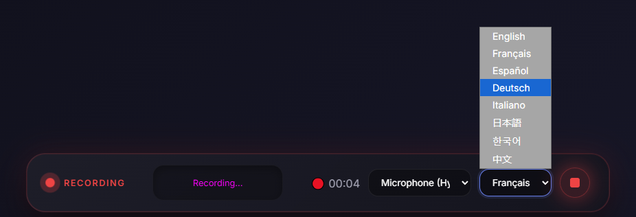

# Ollama WebUI

<div align="center">

**A modern, feature-rich chat interface for interacting with local Ollama AI models**

[](https://opensource.org/licenses/MIT)
[](https://ollama.ai/)

</div>

---

## ✨ Features

100% Made with Antigravity, sorry i'm bad at coding


### 🎨 Modern User Interface

- **Premium Dark Theme** - Sleek glassmorphism design with blur effects and gradients
- **Responsive Layout** - Optimized for desktop, tablet, and mobile devices
- **Smooth Animations** - Polished micro-interactions and transitions
- **Floating Chat Bar** - Centered, pill-shaped input with premium styling

  

### 💬 Chat Capabilities

- **Real-time Streaming** - See AI responses as they're generated, token by token
- **Conversation History** - Automatic local storage of chat sessions
- **Markdown Support** - Full support for formatted text, code blocks, lists, and more
- **Media Embeds** - Automatic detection and embedding of YouTube videos, images, and links
- **Example Prompts** - Quick-start suggestions for new conversations

### 🔍 Web Search Integration

- **DuckDuckGo Search** - Real-time web search powered by DuckDuckGo
- **Contextual Results** - Search results automatically included in AI context
- **Toggle On/Off** - Enable or disable web search with a single click
- **Privacy-Focused** - No tracking, uses DuckDuckGo Lite

### 📊 Cryptocurrency Charts

- **Auto-Detection** - Automatically detects crypto mentions (BTC, $ETH, BTC/USDT, etc.)
- **TradingView Integration** - Professional interactive charts with real-time data
- **15+ Cryptocurrencies** - Support for Bitcoin, Ethereum, Solana, XRP, and more
- **Trading Pairs** - Display charts for any trading pair (BTC/USDT, ETH/BTC, etc.)
- **Dark Theme Charts** - Seamlessly integrated with the UI design


### 🎤 Voice Features

- **Voice Recording** - Record voice messages with audio visualization
- **Speech-to-Text** - Automatic transcription of voice recordings
- **Multi-Language** - Support for 8+ languages (English, French, Spanish, German, etc.)
- **Audio Preview** - Play back recordings before sending



### 🗣️ Text-to-Speech (TTS)

- **Dynamic Voice Selection** - Choose from any available system voice
- **Customizable Settings** - Adjust reading speed and volume
- **Voice Preview** - Test voices before using them
- **Auto-Read** - Option to read AI responses automatically (configurable)

### 🛠️ Additional Features

- **File Attachments** - Upload and attach files to your messages
- **Clear Chat** - One-click conversation reset
- **Connection Status** - Real-time Ollama connection indicator
- **Auto-Resize Input** - Text area grows as you type
- **Keyboard Shortcuts** - Enter to send, Shift+Enter for new line

---

## 🚀 Quick Start

### Prerequisites

- [Ollama](https://ollama.ai/) installed and running
- Node.js (for the web server)
- A modern web browser

### Installation

1. **Start Ollama:**

   ```bash
   ollama serve
   ```

2. **Download a model** (if not already installed):

   ```bash
   ollama pull gemma3:4b
   ```

3. **Launch the WebUI:**

   Simply double-click `start.bat` or run:

   ```bash
   ./start.bat
   ```

### 🐳 Docker (Recommended)

Run the entire stack with a single command:

```bash
docker-compose up -d
```

This will start:

- WebUI on port **8080**
- Search Proxy on port **8081**
- Connect to your local Ollama instance

4. **Open in browser:**

   Navigate to: **<http://localhost:8080>**

---

## ⚙️ Configuration

### Model Settings

Edit the `CONFIG` object in `app.js`:

```javascript
const CONFIG = {
    ollamaHost: 'http://localhost:11434',
    model: 'gemma3:4b',
    webSearchEnabled: false
};
```

**Available Models:**

```bash
ollama list
```

### Web Search

Enable web search by clicking the search icon in the header, or set it as default in `app.js`:

```javascript
webSearchEnabled: true
```

### Cryptocurrency Detection

Supported patterns:

- Symbols: `BTC`, `ETH`, `SOL`, `XRP`
- Dollar signs: `$BTC`, `$ETH`
- Trading pairs: `BTC/USDT`, `BTCUSDT`, `BTC-USDT`

Customize in `crypto-detector.js` to add more cryptocurrencies.

---

## 📁 Project Structure

```
ollama-webui/
├── index.html              # Main HTML structure
├── app.js                  # Core application logic
├── style.css               # Premium UI styling
├── crypto-detector.js      # Cryptocurrency detection
├── web-search.js           # Web search integration
├── media-embeds.js         # Media embedding logic
├── search-server.js        # DuckDuckGo proxy server
├── start.bat               # Windows startup script
└── README.md               # This file
```

---

## 🔧 Troubleshooting

### Connection Issues

**"Disconnected" status:**

- Ensure Ollama is running: `ollama serve`
- Verify Ollama is on port 11434 (default)
- Check firewall settings

### No AI Response

- Verify model is downloaded: `ollama list`
- Check browser console for errors (F12)
- Ensure sufficient system resources

### Web Search Not Working

- Restart the application (`start.bat`)
- Check that port 8081 is available
- Verify internet connection

### Charts Not Loading

- Ensure TradingView script loaded (check browser console)
- Refresh the page (F5)
- Check for ad blockers blocking TradingView

---

## 💡 Usage Tips

### Keyboard Shortcuts

- **Enter** - Send message
- **Shift + Enter** - New line in message
- **Ctrl + C** (in terminal) - Stop servers

### Best Practices

- Use web search for current events and real-time data
- Mention crypto symbols to automatically display charts
- Use voice input for hands-free interaction
- Clear chat regularly for better performance

### Example Queries

```
"What's the Bitcoin price?"
"Search for latest AI news"
"Explain quantum computing"
"$ETH analysis"
"Show me BTC/USDT chart"
```

---

## 🎯 Supported Cryptocurrencies

Bitcoin (BTC), Ethereum (ETH), Binance Coin (BNB), Solana (SOL), Ripple (XRP), Cardano (ADA), Dogecoin (DOGE), Polkadot (DOT), Polygon (MATIC), Avalanche (AVAX), Chainlink (LINK), Uniswap (UNI), and more.

---

## 📝 Technical Details

### Technologies Used

- **Frontend**: Vanilla JavaScript, HTML5, CSS3
- **AI**: Ollama API with streaming support
- **Search**: DuckDuckGo Lite (via proxy)
- **Charts**: TradingView Widgets
- **Voice**: Web Speech API
- **Audio**: AudioMotion Analyzer
- **Markdown**: Marked.js

### Browser Compatibility

- Chrome/Edge (recommended)
- Firefox
- Safari
- Opera

---

## 🤝 Contributing

Contributions are welcome! Feel free to:

- Report bugs
- Suggest features
- Submit pull requests

---

## 📄 License

MIT License - feel free to use this project for personal or commercial purposes.

---

## 🙏 Acknowledgments

- [Ollama](https://ollama.ai/) - Local AI models
- [TradingView](https://www.tradingview.com/) - Financial charts
- [DuckDuckGo](https://duckduckgo.com/) - Privacy-focused search
- [Marked.js](https://marked.js.org/) - Markdown parsing

---

<div align="center">

**Made with ❤️ for the Ollama community**

</div>
